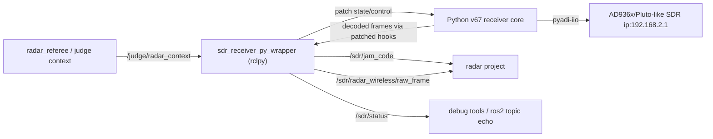

# SDR Receiver Python Wrapper Architecture

日期: 2026-05-13

## 1. 推荐架构

新架构采用“Python 核心 + ROS2 wrapper + monkey patch 适配层”。



设计重点:

- Python v67 继续负责 SDR 硬件、DSP、协议解析、profile/calibration。
- Wrapper 负责 ROS2 通信、比赛状态机、模式隔离、日志桥接、mock 测试。
- Monkey patch 负责在不大改原脚本的前提下拦截键盘、输出解析结果、发布状态、接受 ROS2 控制。
- 现有 C++ `E:\sdr\iq_recevier\sdr_receiver` 不再作为接收算法主线，可复用其 `.msg` 合同、mock 工具思路和文档结构。

## 2. 模块拆分

### 2.1 `sdr_receiver_py_wrapper`

ROS2 Python package，比赛实际入口。

职责:

- 启动 rclpy node。
- 动态 import 原 Python 脚本。
- 应用 monkey patch。
- 维护 `CompetitionController` 状态机。
- 发布 `/sdr/jam_code`、`/sdr/radar_wireless/raw_frame`、`/sdr/status`。
- 订阅 `/judge/radar_context` 或兼容 topic。
- 提供 debug/competition launch。

### 2.2 `original_receiver_adapter.py`

原脚本适配层。

职责:

- 通过 `importlib.util.spec_from_file_location()` 加载原脚本。
- 不修改原脚本任何源码；所有适配都必须发生在 import 之后的 wrapper/patch 层。
- 提供 `ReceiverCoreAdapter`:
  - `set_team(team)`
  - `set_target(target, rescue=None)`
  - `get_stats_snapshot()`
  - `start()`
  - `stop()`
- 集中保存 patch 前的原函数引用，便于恢复。

### 2.3 `patches.py`

Monkey patch 集中管理。

第一阶段推荐 patch 点:

- `handle_keyboard`
  - debug: 保留原函数。
  - competition: 替换为只检查 stop flag，不读键盘。
- `validate_and_parse`
  - 包裹原函数，在原函数成功更新 `STATE`/`D` 后，提取 `cmd_id`、payload、jam key、INFO raw frame 并回调 wrapper。
- `render_dashboard`
  - debug: 保留原 dashboard。
  - competition: 替换为空函数或低频日志，避免终端控制字符干扰 systemd/launch 日志。
- `init_dashboard` / `restore_terminal`
  - competition: 替换为空函数。
  - debug: 保留原函数。
- `select_tune_target`
  - 可包裹，用于记录所有目标切换。

第二阶段可选 patch 点:

- `apply_sdr_config`
  - 用于注入 competition profile、限制现场自动扫频、发布 RF 配置状态。
  - 用于预留 competition micro-tune 开关、范围、步进、超时和回退策略；默认关闭，硬件联调后再决定是否启用。
- `save_profile_db_result`
  - 用于把 debug calibration 结果导出到比赛 YAML。
- `maybe_failover_cal_profile`
  - competition 下可限制 failover 边界。

不建议 patch:

- `fast_demod`
- `process_pool`
- `get_crc8/get_crc16`
- `filter_iq`
- `get_effective_radio_params`

这些是高风险核心算法，除非定位到明确 bug，否则保持原样。

## 3. 主控制流

### 3.1 Debug 模式

1. 启动 wrapper。
2. import 原脚本。
3. 应用最小 patch: 只包裹 `validate_and_parse` 用于 ROS2 发布，不改键盘与 dashboard。
4. 原脚本 `main()` 正常运行。
5. 用户仍按原来的键盘逻辑调试。
6. Wrapper 旁路发布解析结果和状态。

Debug 模式目标是“原脚本手感不变，多一条 ROS2 观测链路”。

### 3.2 Competition 模式

1. 启动 wrapper。
2. import 原脚本。
3. patch dashboard/keyboard，禁用交互。
4. 等待 `/judge/radar_context`。
5. 收到有效 `self_id` 后设置 `TUNE_CFG["TEAM"]`。
6. 收到有效 `jam_level in 1..3` 后进入 jam 状态机。
7. Wrapper 调用原脚本 `select_tune_target("L1"/"L2"/"L3")` 或直接更新 `TUNE_CFG` 并触发 `mark_sdr_config_dirty()`。
8. 原脚本继续 `sdr.rx()` 和 `fast_demod()`。
9. patched `validate_and_parse()` 捕获 `0x0A06` key，发布 `/sdr/jam_code`。
10. 等待 radar_referee 将 key 发给裁判系统并通过新 `0x020E` 回传等级上升。
11. 达到 `max_jam_break_level` 并发布最后一次 key 后切换 INFO。
12. patched `validate_and_parse()` 捕获 `0x0A01..0x0A05`，发布 raw_frame 和后续结构化 topic。

## 4. Competition 状态机

状态建议:

- `WAIT_CONTEXT`: 未收到有效 `self_id` 或 `jam_level`。
- `WAIT_PROFILE`: 已有上下文，但缺少对应 profile 或参数。
- `JAM_L1`: 接收 L1 `0x0A06`。
- `WAIT_LEVEL_L2`: L1 key 已发布，等待 `radar_info` 升到 L2。
- `JAM_L2`: 接收 L2 `0x0A06`。
- `WAIT_LEVEL_L3`: L2 key 已发布，等待 `radar_info` 升到 L3。
- `JAM_L3`: 接收 L3 `0x0A06`。
- `INFO`: 接收 `0x0A01..0x0A05`。
- `ERROR_HOLD`: 配置缺失、SDR 异常、上下文长期无效。

转移规则:

- `self_id == 9` -> RED；`self_id == 109` -> BLUE。
- `self_id` 为其他 1..99 或 101..199 可推断颜色但必须 warning。
- `jam_level == 0` 在 competition 下不驱动目标切换。
- 同一 level 的相同 key 限频发布，默认 500 ms。
- `level < max_jam_break_level`: key 发布后等待更高 `radar_info`。
- `level == max_jam_break_level`: key 发布后直接进入 INFO。

## 5. 线程模型

推荐第一版使用双线程:

- ROS2 主线程: `rclpy.spin()`，处理订阅、发布、状态机。
- Receiver 线程: 调用原脚本 `main()` 或后续 runner。

共享状态通过一个小型 `threading.Lock` 保护:

- 最新 radar context。
- 当前 competition target。
- stop flag。
- 最近已发布 key cache。
- 状态快照。

注意:

- 原脚本本身有大量全局 `STATE` 和 `TUNE_CFG`，wrapper 对它们的写入必须集中在 adapter 方法里。
- 不要从 ROS2 callback 里直接长时间操作 SDR 或做 calibration。
- 如果原脚本 `main()` 只能阻塞运行，stop 可以先通过 patched `handle_keyboard()` 返回 false 或设置 wrapper stop flag 退出。

## 6. ROS2 消息与包组织

短期低风险方案:

- 新建 `sdr_receiver_py_wrapper` Python 包。
- 继续复用 `sdr_receiver/msg/*.msg` 作为消息定义包。
- 如果 C++ 包不再编译核心算法，也可以后续拆出 `sdr_receiver_interfaces`，但第一阶段不建议拆包，避免扩大工程变动。
- 输入接口冻结为优先 `/judge/radar_context`，fallback 到 `/match_info` + `/judge/radar_info`。
- INFO 输出第一阶段冻结为必须发布 `/sdr/radar_wireless/raw_frame`；结构化 topic 第二阶段再补齐。

建议 launch:

- `debug_receiver.launch.py`
  - `run_mode=debug`
  - `publish_ros_outputs=true`
  - `debug_accept_ros_control=false`
- `competition_receiver.launch.py`
  - `run_mode=competition`
  - `original_script_path=...`
  - `max_jam_break_level=3`
  - `profile_path=...`
  - `match_slot=bo3_game1`
  - `front_end_id=front_end_A`

## 7. Ubuntu 22.04 部署计划

建议目录:

```text
~/radar_ws/src/sdr_receiver/
~/radar_ws/src/sdr_receiver_py_wrapper/
~/radar_ws/src/3SE_2026_Radar/
~/sdr_runtime/venv/
~/sdr_runtime/profiles/
~/sdr_runtime/logs/
```

环境冻结为 Ubuntu 22.04 + ROS2 Humble + Python 3.10:

```bash
sudo apt install ros-humble-desktop python3-venv python3-pip libiio-dev iiod
python3 -m venv ~/sdr_runtime/venv --system-site-packages
source ~/sdr_runtime/venv/bin/activate
pip install -r requirements.txt
```

`--system-site-packages` 是关键，因为 `rclpy` 来自 ROS2 系统 Python。

运行:

```bash
source /opt/ros/humble/setup.bash
source ~/radar_ws/install/setup.bash
source ~/sdr_runtime/venv/bin/activate
ros2 launch sdr_receiver_py_wrapper competition_receiver.launch.py
```

## 8. 测试分层

### 8.1 Import smoke test

目标: Ubuntu 上能 import 原脚本，不自动启动 `main()`。

检查:

- `adi`、`numpy`、`scipy` 等依赖可用。
- wrapper 能加载脚本并找到 `STATE`、`TUNE_CFG`、`validate_and_parse`、`select_tune_target`、`main`。

### 8.2 Patch 单元测试

目标: patch 不破坏原函数。

用例:

- patch 后调用 `validate_and_parse(0x0A06, b"ABCDEF")`，原状态更新，wrapper callback 收到 key。
- competition 下 `handle_keyboard()` 不读终端。
- debug 下 `handle_keyboard()` 仍使用原函数。

### 8.3 ROS2 通信测试

目标: 不接 SDR，也能验证状态机和 topic。

用例:

- mock 发布 `self_id=9, jam_level=1`。
- 注入 fake decoded key L1，检查 `/sdr/jam_code level=1 team=RED`。
- mock 发布 L2/L3，检查状态推进。
- L3 key 发布后检查 target 切 INFO。

### 8.4 硬件联调测试

目标: 接真实 SDR 和发射源。

步骤:

1. debug 模式确认原脚本行为没有变。
2. debug 模式确认 ROS2 topic 能旁路看到 key/raw_frame。
3. competition 模式使用 mock radar context 驱动 L1/L2/L3。
4. 接入 radar_referee 真实 `/judge/radar_context`。
5. 接入裁判系统闭环，确认 key -> 0x020E 等级上升。

## 9. 主要风险与对策

- 风险: 原脚本 `main()` 强耦合 dashboard、键盘和 SDR。
  - 对策: 第一版用 monkey patch 屏蔽 dashboard/keyboard；若不稳定，再做最小 runner 改造。

- 风险: ROS2 callback 与原脚本全局状态并发写入。
  - 对策: 所有写 `TUNE_CFG`/`STATE` 的操作集中到 adapter，使用 lock。

- 风险: competition 模式误触发 debug calibration 或 failover。
  - 对策: competition patch 中禁用键盘，并用参数限制 calibration/failover。

- 风险: venv 中 `rclpy` 与 pip 依赖冲突。
  - 对策: Ubuntu 22.04 使用 Python 3.10 venv + `--system-site-packages`，禁止换 Python 大版本。

- 风险: RadarContext 短期无法落地到 radar 工程。
  - 对策: 提供 `/match_info` + `/judge/radar_info` 兼容订阅，并保留 mock publisher。

## 10. 推荐实施顺序

1. 新建 `sdr_receiver_py_wrapper` 包和 launch。
2. 写 import adapter，验证能加载原脚本且不执行 `main()`。
3. 实现 debug 模式最小 patch，只发布 `/sdr/status` 和 `/sdr/jam_code`。
4. 实现 competition 键盘/dashboard patch。
5. 实现 `CompetitionController` 状态机。
6. 接入 `/judge/radar_context` 和 mock 工具。
7. 补 raw_frame 发布。
8. Ubuntu 22.04 上做 import、mock、真 SDR 三层测试。
9. 与 radar_referee 对接 key 发送闭环。

## 11. 是否需要新会话

架构稳定后，建议在新的最高推理实现会话中开始编码。原因是下一阶段会涉及 ROS2 Python 包、launch、patch adapter、状态机、测试脚本和部署文档，模块较多，新的实现会话能减少旧 C++ 重构上下文对代码决策的干扰。

新会话应复制:

- 本文档。
- `sdr_receiver_python_wrapper_requirements.md`。
- 原 Python 脚本路径。
- 当前 `sdr_receiver/msg` 合同。
- radar 工程中 `MatchInfo.msg` 与 `RefereeControl.cpp` 的相关约束。

## 12. 已冻结决策

- 原 Python 脚本零改动。不得为了 wrapper 集成修改 `receiving_messages_adaptive_filter_v67_l2cal_20260505_l2rescue_80k_g40.py`。
- Micro-tune 作为 competition 可选能力预留，参数接口先设计好，默认关闭。硬件联调后只需要改 launch/YAML 参数，不应改状态机主流程。
- ROS2 裁判上下文优先走 `/judge/radar_context`，并保留 `/match_info` + `/judge/radar_info` 兼容路径。
- INFO 第一版只冻结 raw_frame 作为必需接口，结构化 topic 第二阶段实现。
- 部署环境冻结为 Ubuntu 22.04 + ROS2 Humble + Python 3.10，venv 使用 `--system-site-packages`。
