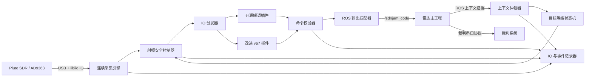
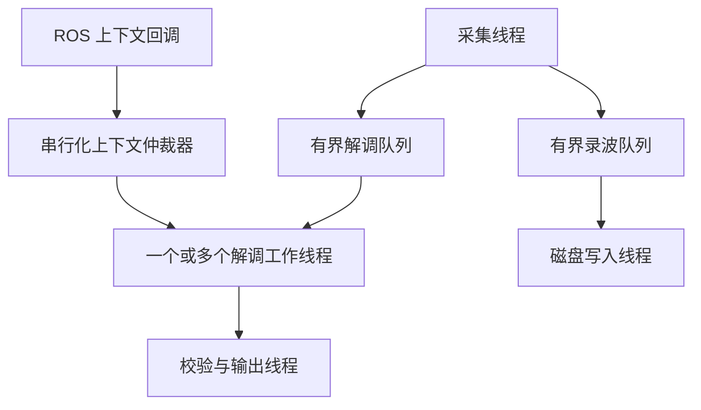

# SDR 解析波接收工程架构设计

日期：2026-07-10

## 1. 核心决策

采用运行在雷达主机上的公共接收底座，并通过两个纯计算解调插件提供开源方案和改进 v67 方案。公共底座独占 SDR 硬件、上下文仲裁、录波、结果校验和 ROS 输出职责。由于解析端和雷达主工程运行在同一 ROS 2 主机，不引入开源方案的 TCP 桥。

## 2. 系统上下文



## 3. 组件职责

### 3.1 `DeviceSession`：设备会话

- 独占一个 libiio/pyadi 连接。
- 设置采样率、LO、RF 带宽和增益。
- 使用有界退避策略执行重连。
- 输出设备错误和完整配置快照。

任何解调插件都不能获得 `Pluto` 对象或设备控制回调。

### 3.2 `AcquisitionEngine`：连续采集引擎

- 连续读取固定大小的 IQ chunk。
- 分配单调递增的 chunk 编号和样本索引。
- 使用主机墙钟和单调时钟记录接收时间。
- 将数据送入有界解调队列和录波队列。
- 统计队列丢弃、超时、重连和有效采集占空比。

磁盘写入和解调计算不得运行在采集循环中。

### 3.3 `RfSafetyController`：射频安全控制器

- 使用显式 ADC 标度计算 I/Q 峰值、RMS、贴轨比例、削顶比例和直流偏置。
- 输出 `RF_LOW`、`RF_LINEAR`、`RF_HIGH`、`RF_CLIPPED`、`RF_DISCONNECTED` 状态。
- 对自动增益命令执行限幅和速率限制。
- 发生削顶时禁止继续高增益扫描。
- 每次硬件参数变化必须包含完整原因。

外置 LNA 和有源 SAW 虽然不能由软件控制，但其增益和旁路状态必须写入部署配置及录波元数据。

### 3.4 `ContextArbiter`：上下文仲裁器

所有输入统一转换为 `ContextObservation`：

```text
source, self_id, self_color, radar_info_raw, jam_level,
key_mutable, game_progress, match_time,
ros_receive_wall_time, ros_receive_monotonic_ns
```

仲裁规则：

1. 只有一个配置的权威来源能够驱动状态机。
2. 诊断来源只用于比较，不得覆盖权威来源。
3. `self_id` 只接受 9 或 109，初始化后锁定队伍。
4. 赛前等级变化只记录，不驱动切频。
5. 比赛中等级变化必须通过稳定性确认。
6. 每次采纳或拒绝都生成原因和上下文版本。

雷达主工程新增话题只发布它当前已经拥有的数据，不要求新增裁判帧序号或串口底层时间戳。

### 3.5 `TargetStateMachine`：目标等级状态机

```text
WAIT_CONTEXT -> PREMATCH_READY -> LISTEN_L1 -> LISTEN_L2 -> LISTEN_L3 -> INFO
                                      ^           ^           ^
                                      +-----------+-----------+
                                           官方稳定上下文
```

解出密钥本身不能直接提升监听等级。只有权威上下文确认裁判系统已经更新等级后，状态机才能前进。官方上下文稳定恢复到较低等级时，状态机必须能够回退到相应监听目标。

### 3.6 `DecoderPlugin`：解调插件

统一接口：

```text
decode(IqChunk, DecodeContext) -> list[DecodedCommand]
reset(ResetReason, DecodeContext)
stats() -> DecoderStats
```

插件约束：

- 不控制 SDR。
- 不发布 ROS 或 TCP 数据。
- 不在插件内部切换监听等级。
- 不维护隐藏的硬件全局配置。
- 相同 IQ 和上下文必须得到可重复的离线结果。

开源插件适配 CombatRadarSdr2026 的 PHY 和 parser。改进 v67 插件在相同接口后保留经过验证的校准与救援能力。

### 3.7 `CommandValidator`：命令校验器

- 要求合法空口协议证据和支持的命令 ID。
- 对 `0x0A06` 要求 payload 恰好为六个 ASCII 字母或数字。
- 按命令、payload、等级和时间策略去重。
- 为结果附加解调器、射频和上下文证据。
- 在影子模式中对比两个插件输出并报告分歧。

### 3.8 `RosOutputAdapter`：ROS 输出适配器

将通过验证的 `DecodedCommand(0x0A06)` 转换为现有 `sdr_receiver/msg/JamCode`。这是生产模式下唯一的 JamCode 发布者。公共底座不为本机通信重新构造 A5 帧，因为向裁判系统发送数据属于雷达主工程职责。

### 3.9 `Recorder`：录波与事件记录器

输出文件：

- `.c64`：连续 `complex64` IQ。
- `.chunks.jsonl`：逐 chunk 的样本、时间、射频和上下文元数据。
- `.events.jsonl`：上下文决策、RF 变化、解调阶段、命令、丢样和错误。
- `.summary.json`：文件哈希、计数、采集占空比、最终配置和停止原因。

chunk 元数据通过样本索引引用 IQ，复盘不能只依赖墙钟时间对齐。

## 4. 核心数据结构

### 4.1 `IqChunk`

```text
chunk_id, first_sample_index, samples,
sample_rate_hz, rx_wall_time, rx_monotonic_ns,
lo_hz, rf_bandwidth_hz, rx_gain_db,
rf_metrics, target_version, context_version
```

### 4.2 `DecodedCommand`

```text
cmd_id, payload, decoder_id, profile,
crc8_ok, crc16_ok, crc_mode,
first_sample_index, last_sample_index,
receive_wall_time, target, team,
context_version, evidence
```

### 4.3 `ContextDecision`

```text
observation, accepted, reason,
previous_context_version, new_context_version,
old_target, new_target
```

## 5. 并发模型



比赛模式优先保证连续采集。消费者无法跟上时，系统必须明确记录队列溢出，不得静默阻塞 libiio 接收。

## 6. 射频运行策略

1. 使用保守 SDR 增益启动，并在配置中声明外置 LNA、SAW 和衰减器状态。
2. 在启用解调和扫频前先判断是否削顶。
3. 发生削顶时立即降低 SDR 增益；最低增益仍削顶时提示增加衰减或旁路 LNA。
4. 只有在 `RF_LINEAR` 状态下才允许搜索频率和 profile。
5. AC 缺失但存在削顶或高贴轨比例时，禁止增加增益。

## 7. 开源方案整合边界

参考或适配以下内容：

- 固定无线 profile。
- 匹配滤波与 2-GFSK 解调路径。
- 候选切片和协议帧解析。
- CRC 校验与六字节密钥提取。

不引入以下内容：

- `RadarServerComm`。
- localhost TCP 控制协议。
- 为本机 IPC 重新封装 A5 帧。
- 解调插件自行控制 SDR。
- 解调插件自行切换等级。

## 8. 故障分类

接收状态必须区分：

- `CONTEXT_INVALID`：上下文非法。
- `CONTEXT_CONFLICT`：多个来源冲突。
- `RF_DISCONNECTED`、`RF_LOW`、`RF_CLIPPED`：射频或设备故障。
- `ACQUISITION_DROP`：采集丢失。
- `NO_ACCESS_CODE`：未检测到接入码。
- `HEADER_ONLY`、`CRC8_ONLY`、`CRC16_FAIL`：不同协议阶段失败。
- `COMMAND_REJECTED`：命令语义校验失败。
- `ROS_OUTPUT_ERROR`：ROS 输出失败。

当系统从未检测到接入码时，不得笼统报告为 CRC16 失败。

## 9. 测试设计

### 9.1 离线测试

- 正样本：经过确认并记录哈希与期望结果的 `RX_BLUE_ganrao_1/2/3`。
- 负样本：现场 BO3 录波，预期不输出密钥，并报告 RF 与上下文故障。
- 人工异常：截断、加噪、削顶、重复 chunk、丢 chunk 和上下文跳变。

### 9.2 集成测试

- 分别通过两个插件回放 IQ，并验证 ROS JamCode 输出。
- 验证雷达主工程订阅和密钥第二阶段路径。
- 回放异常 ID 和赛前短暂 L3。
- 验证诊断来源不能控制目标状态。

### 9.3 硬件测试

- 首先进行 SDR 直连测试，不接外置增益级。
- 逐个加入 SAW、LNA 和衰减器。
- 扫描发射距离和增益，测量削顶余量。
- 进行带采集占空比和丢样断言的长时间测试。

## 10. 分支设计

### 10.1 `codex/open-source-replacement`

实现最小公共硬件、上下文和输出外壳，并接入一个开源解调插件。该分支用于建立简单、确定的参考基线，必须通过离线和 ROS 闭环测试。

### 10.2 `codex/hybrid-receiver`

实现完整公共底座、两个解调插件、影子对比、上下文仲裁、射频安全和结构化录波。该分支是推荐的生产候选方案。

只有统一验收证据完成评审后，选定实现才能回到 `main`。

## 11. 已知诊断边界

雷达主工程本期只发布它当前已经拥有的数据，因此解析端可以证明哪一条 ROS 上下文触发了等级切换，但不能独立证明裁判串口层是否重复、乱序或延迟了底层帧。如果未来证据表明必须区分这些情况，可以再由雷达主工程增加裁判帧序号和底层接收时间，而不需要改变本架构的组件边界。
