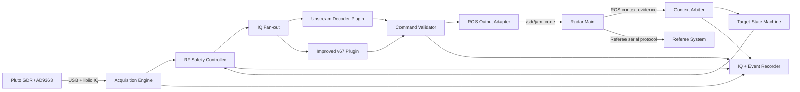
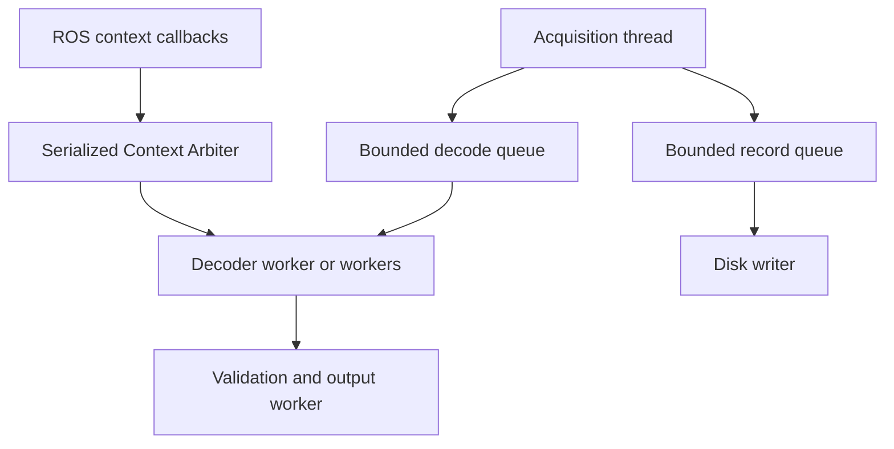

# SDR Receiver Architecture Design

Date: 2026-07-10

## 1. Decision Summary

Use a host-side common receiver foundation with two pure decoder plugins. The foundation exclusively owns SDR hardware, context arbitration, recording, validation, and ROS output. The upstream TCP bridge is not included because both receiver and radar main run on the same ROS 2 host.

## 2. System Context



## 3. Component Responsibilities

### 3.1 DeviceSession

- Own one libiio/pyadi connection.
- Apply sample rate, LO, RF bandwidth, and gain commands.
- Reconnect with bounded backoff.
- Expose device errors and configuration snapshots.

No decoder receives a `Pluto` object or device callback.

### 3.2 AcquisitionEngine

- Read fixed-size IQ chunks continuously.
- Assign monotonically increasing chunk and sample indices.
- Timestamp reception with host wall and monotonic clocks.
- Push chunks into bounded decode and record queues.
- Count queue drops, timeouts, reconnects, and effective duty.

Disk writes and decoder execution never run in the acquisition loop.

### 3.3 RfSafetyController

- Compute I/Q peak, RMS, rail occupancy, clipping ratio, and DC offset using an explicit scale.
- Classify `RF_LOW`, `RF_LINEAR`, `RF_HIGH`, `RF_CLIPPED`, and `RF_DISCONNECTED`.
- Clamp and rate-limit gain decisions.
- Block aggressive scanning while clipped.
- Produce a complete reason for each hardware setting change.

External LNA/SAW gain is represented in deployment configuration even though software cannot directly control it.

### 3.4 ContextArbiter

Inputs are normalized into `ContextObservation`:

```text
source, self_id, self_color, radar_info_raw, jam_level,
key_mutable, game_progress, match_time,
ros_receive_wall_time, ros_receive_monotonic_ns
```

Policy:

1. One configured authoritative source drives state.
2. Diagnostic sources are compared but never overwrite authority.
3. IDs must be 9 or 109; team is locked after initialization.
4. Pre-match level changes are logged only.
5. In-match transitions require stability confirmation.
6. Every decision has an accepted/rejected reason and context version.

The new radar-main topic publishes only fields already owned by radar main. It does not require referee sequence or low-level transport timestamp changes.

### 3.5 TargetStateMachine

States:

```text
WAIT_CONTEXT -> PREMATCH_READY -> LISTEN_L1 -> LISTEN_L2 -> LISTEN_L3 -> INFO
                                      ^           ^           ^
                                      +-----------+-----------+
                                          official stable context
```

A decoded key does not advance the listening level by itself. Advancement occurs only after the authoritative context confirms the official level. Stable lower levels can move the state machine back to the corresponding listener.

### 3.6 DecoderPlugin

```text
decode(IqChunk, DecodeContext) -> list[DecodedCommand]
reset(ResetReason, DecodeContext)
stats() -> DecoderStats
```

Restrictions:

- No SDR control.
- No ROS or TCP publication.
- No hidden target switching.
- No mutable global hardware configuration.
- Deterministic replay for identical IQ and context.

The upstream plugin adapts CombatRadarSdr2026 PHY/parser behavior. The improved v67 plugin preserves useful calibration and rescue behavior behind the same interface.

### 3.7 CommandValidator

- Require valid air protocol evidence and supported command ID.
- For `0x0A06`, require exactly six ASCII alphanumeric bytes.
- Deduplicate by command, payload, level, and time policy.
- Attach decoder identity and RF/context evidence.
- In shadow mode, compare plugin outputs and report disagreements.

### 3.8 RosOutputAdapter

Convert a validated `DecodedCommand(0x0A06)` into the existing `sdr_receiver/msg/JamCode`. This is the only production JamCode publisher. It does not create a local A5 frame because radar main already owns referee-system transmission.

### 3.9 Recorder

Artifacts:

- `.c64`: contiguous complex64 IQ.
- `.chunks.jsonl`: per-chunk sample/time/RF/context metadata.
- `.events.jsonl`: context decisions, RF changes, decoder stages, commands, drops, and errors.
- `.summary.json`: hashes, totals, duty, final configuration, and stop reason.

Chunk metadata references IQ by sample index, so event replay does not depend on wall-clock alignment alone.

## 4. Data Contracts

### IqChunk

```text
chunk_id, first_sample_index, samples,
sample_rate_hz, rx_wall_time, rx_monotonic_ns,
lo_hz, rf_bandwidth_hz, rx_gain_db,
rf_metrics, target_version, context_version
```

### DecodedCommand

```text
cmd_id, payload, decoder_id, profile,
crc8_ok, crc16_ok, crc_mode,
first_sample_index, last_sample_index,
receive_wall_time, target, team,
context_version, evidence
```

### ContextDecision

```text
observation, accepted, reason,
previous_context_version, new_context_version,
old_target, new_target
```

## 5. Concurrency Model



Competition mode prioritizes acquisition. If a consumer cannot keep up, the system records an explicit queue overflow instead of silently blocking libiio reception.

## 6. RF Operating Policy

1. Start at conservative SDR gain with external LNA/SAW state declared in configuration.
2. Measure clipping before enabling decoder-driven diagnostics.
3. On clipping, reduce SDR gain immediately and recommend attenuation/LNA bypass if minimum gain is insufficient.
4. Only search frequency/profile variants while the RF state is linear.
5. Never increase gain solely because AC is absent when clipping or high rail occupancy is present.

## 7. Open-Source Integration

Import or adapt:

- fixed radio profiles,
- matched-filter and 2-GFSK demodulation path,
- candidate slicing and frame parsing,
- CRC validation and six-byte key extraction.

Do not import:

- `RadarServerComm`,
- localhost TCP control protocol,
- A5 repacking for IPC,
- plugin-owned SDR control,
- plugin-owned level switching.

## 8. Failure Classification

The status model shall distinguish:

- `CONTEXT_INVALID` or `CONTEXT_CONFLICT`,
- `RF_DISCONNECTED`, `RF_LOW`, or `RF_CLIPPED`,
- `ACQUISITION_DROP`,
- `NO_ACCESS_CODE`,
- `HEADER_ONLY`, `CRC8_ONLY`, or `CRC16_FAIL`,
- `COMMAND_REJECTED`,
- `ROS_OUTPUT_ERROR`.

This prevents a late CRC error from being reported when the receiver never detected an access code.

## 9. Test Architecture

### Offline

- Positive fixtures: approved `RX_BLUE_ganrao_1/2/3` with hashes and expected outputs.
- Negative fixture: field BO3 recording, expected no key plus RF/context fault classification.
- Synthetic corruption: truncation, noise, clipping, duplicate chunks, and context transitions.

### Integration

- Replay IQ through each plugin and ROS JamCode adapter.
- Verify radar-main subscription and phase-2 key path.
- Replay invalid IDs and pre-match L3 excursions.
- Confirm diagnostic topics cannot control the target.

### Hardware

- SDR direct connection before external gain stages.
- Add SAW, LNA, and attenuation one component at a time.
- Sweep transmitter distance and gain while measuring clipping margin.
- Run a representative endurance capture with duty and drop assertions.

## 10. Branch Strategy

### codex/open-source-replacement

Build the minimum common hardware/context/output shell and one upstream decoder plugin. This branch establishes a simple known reference and must pass offline and ROS closed-loop tests.

### codex/hybrid-receiver

Build the complete architecture, both decoder plugins, shadow comparison, context arbitration, RF safety, and structured recording. This is the recommended production candidate.

The selected implementation returns to `main` only after common acceptance evidence is reviewed.

## 11. Known Diagnostic Limit

Because radar main will publish only data it already owns, the receiver can prove which ROS observation caused a transition but cannot independently prove whether the referee serial layer duplicated, reordered, or delayed the underlying frame. If future evidence requires that distinction, radar main may later add referee frame sequence and low-level receive timestamps without changing the receiver architecture.

